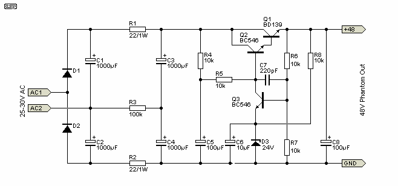
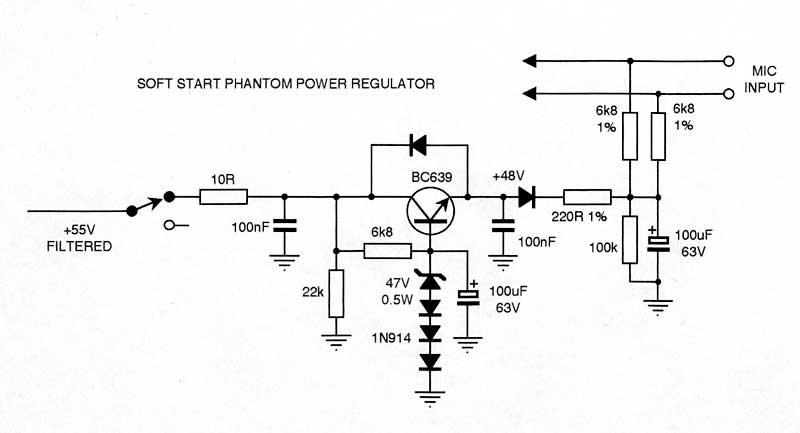

## Overview

Little box I put together in my final year of uni. Our group design project needed a condenser mic and we’d already gone and bought one — then realised none of us had a way to actually power the thing. Commercial phantom boxes weren’t happening on a student budget, so I threw one together on Veroboard over a weekend and stuffed it in an ABS jiffy box.

## The Circuit

Two stages, nothing clever.

Front end is a 25–30VAC transformer into a full-wave bridge (1N4004s), 1000µF bulk caps, then a discrete BJT regulator — BD139 pass, BC546 error amp, 24V zener reference. Gives a clean rail for the next stage.

Phantom side is a soft-start regulator. BC639 pass transistor with its base pulled up through a string of 1N914s and a 47V zener. The 100µF on the base ramps the output gently up to +48V instead of slamming it on the moment you flip the switch — last thing you want is to cook a brand new mic. 6k8 1% resistors on the XLR pins for the standard phantom feed.

  

    
  

  

    
  

## Final Thoughts

Did the job. Powered the mic the whole way through the project and never made a peep on the audio.

-SM
