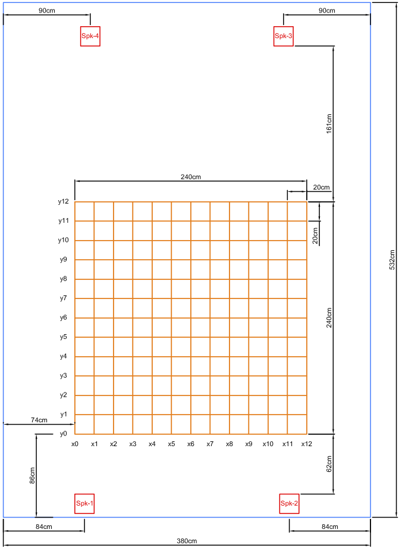
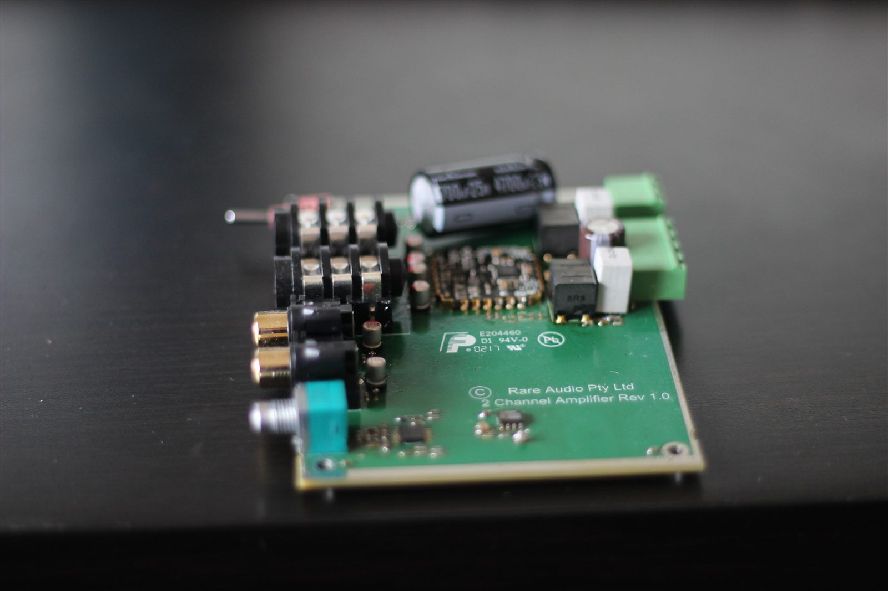
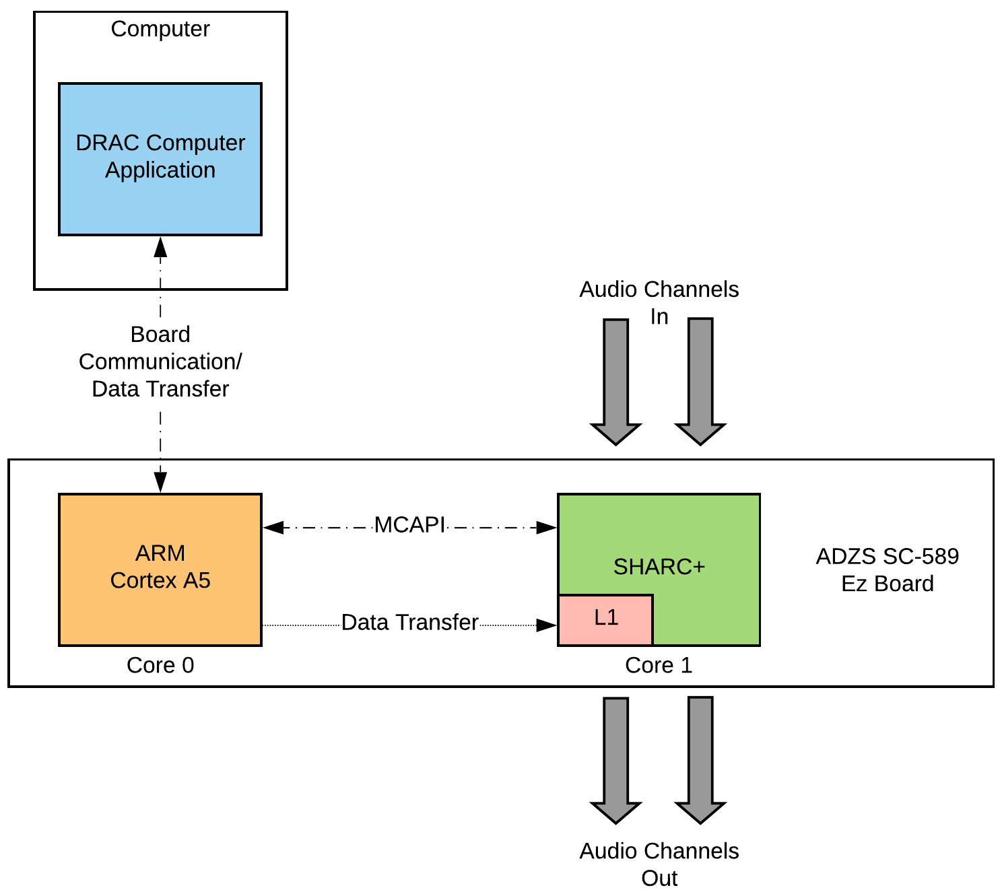
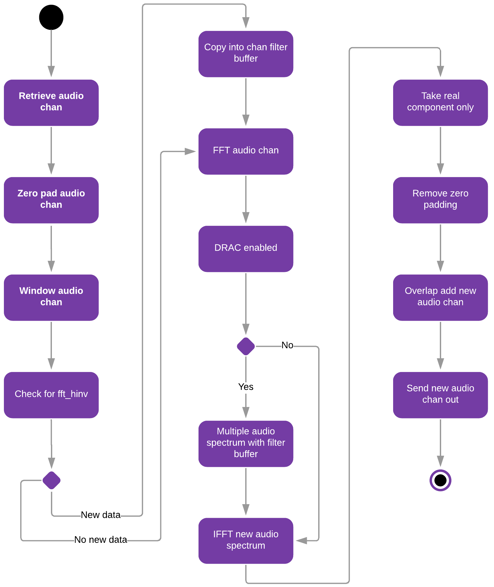
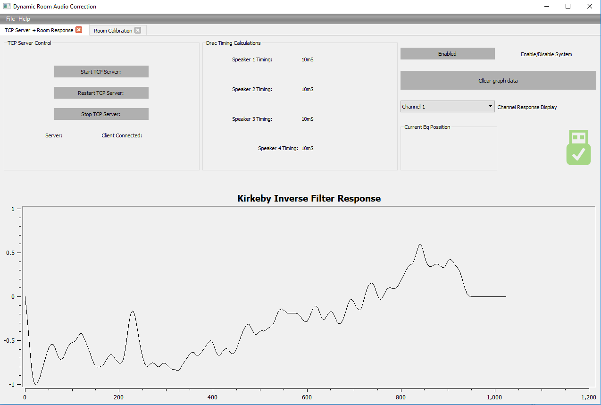
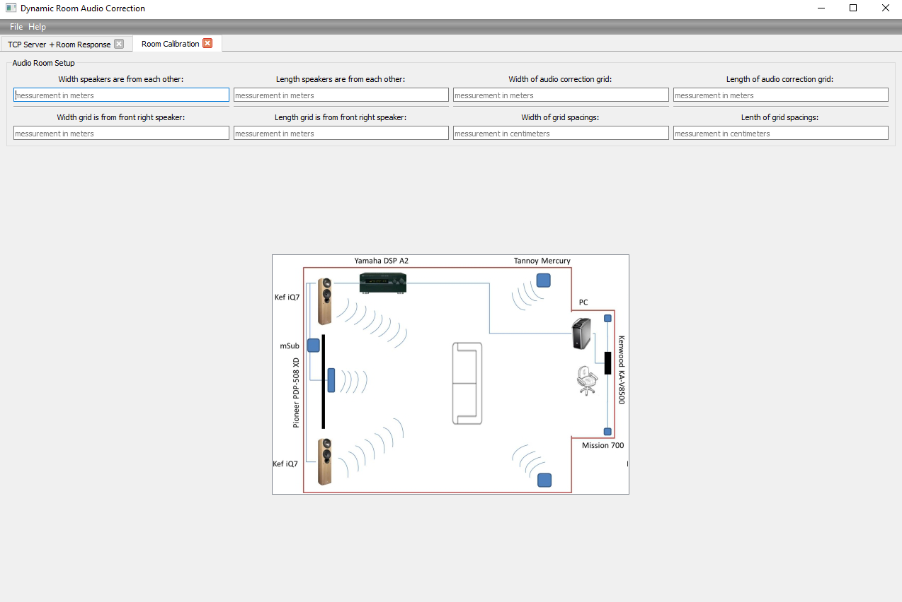
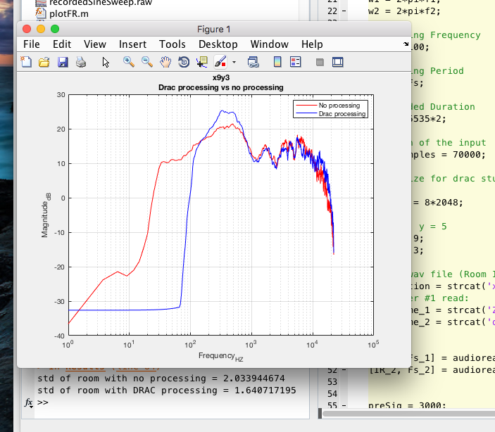
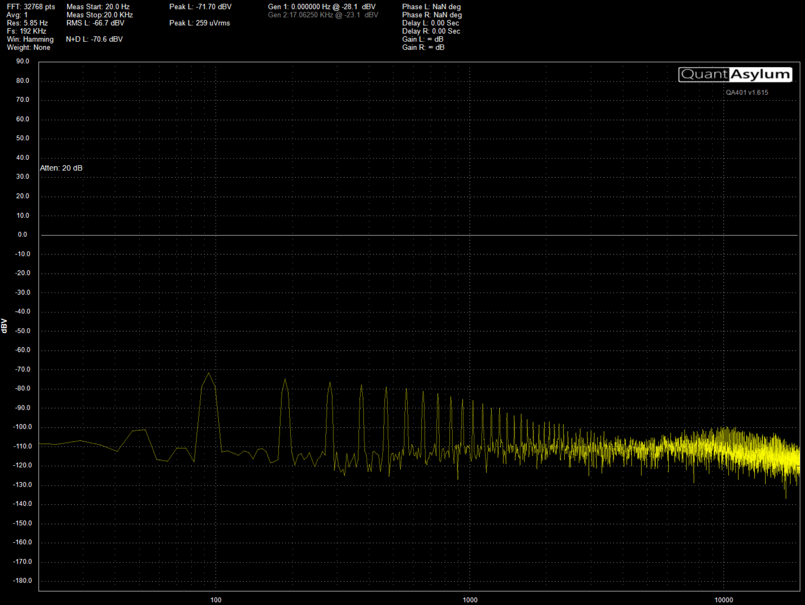

## Table of contents
- [Overview](#overview)
- [Why bother — the problem with static room EQ](#why-bother--the-problem-with-static-room-eq)
- [The team and how the system was split](#the-team-and-how-the-system-was-split)
- [The room and the gear](#the-room-and-the-gear)
- [The DSP — why Kirkeby](#the-dsp--why-kirkeby)
- [The embedded side — SC589, ARM and SHARC](#the-embedded-side--sc589-arm-and-sharc)
- [The L1 cache trick that saved the project](#the-l1-cache-trick-that-saved-the-project)
- [The UART bottleneck and the workaround that shipped](#the-uart-bottleneck-and-the-workaround-that-shipped)
- [The PC application](#the-pc-application)
- [Results — the honest version](#results--the-honest-version)
- [Looking back from 2026](#looking-back-from-2026)
- [The kicker](#the-kicker)

## Overview

Year-long final year RMIT Capstone, sponsored by [Fiberdyne Systems](https://fiberdyne.com.au/) and supervised by Dr PJ Radcliffe. We called it **DRAC — Dynamic Room Audio Correction**. Track where the listener is, update the speaker EQ in real time, so wherever they stand they hear the mix the way the mix was made. Submitted October 2018, demoed at EnGenius. Week we submitted I had a full-time offer at Fiberdyne.

It's also where my [phantom power supply post](../mic-phantom-power-supply/) came from — that was built specifically to feed the condenser mic Fiberdyne lent us for the room measurements.

## Why bother — the problem with static room EQ

Every "room correction" product on the market in 2018 — Dirac Live, Sonarworks Reference, IK Multimedia ARC, Anthem ARC — does the same thing. You stick a measurement mic in your favourite chair, the system fires sweeps, and you get a fixed filter that makes *that one spot* sound flat. Move out of the chair and the correction is wrong, sometimes actively worse — you're now hearing room modes through a filter built for a different position.

Multi-Point Room Correction is a bit better — measure a handful of seats, average — but it just smears the wrongness across a larger area. Still assumes you don't move.

DRAC's idea: track where the listener actually is and move the EQ with them. A camera watching the room, position fed to a database of pre-measured impulse responses, the matching filter pushed to the DSP. Whiteboard easy. Build-it-on-a-$300-student-budget hard.

## The team and how the system was split

Three of us, three modules:

- **Shawn Buschmann** — computer vision. 3D sensor watching the listening area, person detection, mapping the user's body position into grid coordinates.
- **Zachary Dumic** — Room Impulse Response prediction. Took the grid coordinate from Shawn, looked up (or predicted, in the ML branch) the matching pre-recorded RIR, ran the FFT, and pushed a frequency-response payload at me over TCP/IP.
- **Me** — the DSP filtering and equalisation module. Receive the FR data, run the Kirkeby inverse-filter maths, push the resulting filter into a multi-channel real-time fast-convolution running on a SHARC DSP, and provide the GUI that drove the whole thing.

Three laptops, one per module, talking to each other over TCP/IP. ML training and OpenCV both pegged a CPU each, and my Qt app had to stay responsive while shovelling data to the dev board, so a laptop apiece was the easy answer. We tried file-based IPC for about a week. Awful. Sockets sorted it.

## The room and the gear

The "test lab" was my lounge room — 5.32 m × 3.80 m. We laid out four corner speakers (front-left, front-right, rear-left, rear-right — no centre, no sub) and marked a 2.4 m × 2.4 m grid in the listening area on 20 cm spacing, giving us 13 × 13 = 169 measurement positions per speaker, 676 across the four speakers. Every position got an Exponential Sine Sweep recording. That's a lot of evenings holding a microphone on a tripod and not making any noise.

Hardware bill of materials:

- **ADSP-SC589 EZ-KIT Lite** — Analog Devices' triple-core dev board. One ARM Cortex-A5 plus two SHARC+ DSPs sharing memory on-die. Loaned by Fiberdyne.
- **Fiberdyne 4-channel amp** — they gave us four bare boards and a bag of SMD parts. We hand-soldered all four amps under a microscope. First serious SMD work I'd ever done.
- **Condenser measurement mic** — also from Fiberdyne, needing 48 V phantom — hence the phantom supply on Veroboard.
- **Four bookshelf speakers** — borrowed.
- **A laptop for the DRAC app, a laptop for Zac's MATLAB, a laptop for Shawn's vision** — all on a Wi-Fi router pretending to be a LAN.

<div style="display: flex; gap: 1.5rem; justify-content: center; flex-wrap: wrap; margin: 2rem 0;">
  <div style="flex: 1 1 100%; text-align: center;">
    
  </div>
  <div style="flex: 1 1 100%; text-align: center;">
    
  </div>
</div>

## The DSP — why Kirkeby

Measure the room's impulse response `h(t)`. Want a filter that undoes it, so what goes in is what comes out. Divide. `H_inv(ω) = 1 / H(ω)`. Done.

Except that blows up. Anywhere the room has a deep null — comb-filter dip from a wall reflection, that kind of thing — the inverse runs to infinity, the tweeters cook, and the neighbours come round.

Kirkeby is regularised division:

```
            C*(ω)
H_inv(ω) = ─────────────────────────
           |C(ω)|² + β·Re(g(ω))
```

`C(ω)` is the measured frequency response, `C*(ω)` its conjugate, `β` a strength knob, `g(ω)` a frequency-dependent regulariser. Crank `β` up in a band and the filter backs off. Drop it to zero and you're back to plain deconvolution. Tune `g(ω)` to keep the filter active across the audible range and idle everywhere the measurement isn't trustworthy — sub-bass, ultrasonics, the deep nulls.

I picked Kirkeby over Linear Predictive Coding, homomorphic filtering and least-squares optimisation for one reason: cycles. The whole point of running this on a SHARC was real-time, per-block convolution at 44.1 kHz. Kirkeby is an FFT, a complex multiply, an IFFT and an overlap-add. Everything else on the shortlist was at least an order of magnitude more expensive and would have cost me audio channels.

## The embedded side — SC589, ARM and SHARC

Two cores, two completely different jobs.

**The SHARC** ran Fiberdyne's proprietary DSP framework — bare-metal, hand-rolled audio engine, single-cycle access to L1 cache, hardware FFT/IFFT accelerators. Fiberdyne had been porting the framework from a different architecture (where it was fract-based) onto the SHARC's native floating-point. Part of my job was finishing that port for the bits I needed and writing the FFT/IFFT drivers that hit the hardware accelerator instead of the software library version. The per-channel inner loop:

1. Pull a block of audio in
2. Window it, zero-pad it
3. Hardware FFT
4. Multiply spectrum by the current inverse-filter spectrum
5. Hardware IFFT
6. Take the real component, strip the zero-pad
7. Overlap-add into the output buffer
8. Send out

Standard fast-convolution overlap-add. Four channels in parallel. The SHARC chewed through it at 44.1 kHz with cycles to spare, which was the entire reason for picking that algorithm.

**The ARM Cortex-A5** ran the comms side — bare-metal also. UART receiver from the PC's USB-CDC, MCAPI (Analog Devices' Multi-Core Communication API) channel into the SHARC for command messages, and the orchestration logic that turned an inbound payload into a SHARC update. The ARM never touched audio.

<div style="display: flex; gap: 1.5rem; justify-content: center; flex-wrap: wrap; margin: 2rem 0;">
  <div style="flex: 1 1 100%; text-align: center;">
    
  </div>
  <div style="flex: 1 1 100%; text-align: center;">
    
  </div>
</div>

## The L1 cache trick that saved the project

The first version had a problem. The original design used external SDRAM as a shared region between the ARM and the SHARC. ARM writes new filter coefficients into shared memory; SHARC reads them out. Clean, simple, textbook.

Too slow. The SHARC was already maxed out servicing the audio block timer. Adding external-memory reads in the inner loop pushed the convolution past the 44.1 kHz block deadline and the ping-pong audio buffers started overrunning. You could hear it — the output was a glitch-fest.

MCAPI was the obvious fallback for inter-core communication, but the message size was capped well below the FR payload I needed to transfer. So I went the other way. The SHARC has single-cycle access to its own L1 cache. What if the ARM could write directly into the SHARC's L1?

It can. There's an Abstract Page Table on the SC589 that lets you grant cross-core access to memory regions. A few days of reading the hardware reference and a lot of compile errors later, I had a custom APT configuration that gave the ARM read/write access to a designated chunk of SHARC L1. SHARC allocates the buffer at startup, passes the pointer to the ARM over MCAPI, ARM stores it, and from then on every FR update is a direct DMA into the SHARC's single-cycle cache. Audio glitches gone.

Still the bit of the project I'm proudest of. First time I'd had to read past the example code and actually understand what the hardware was doing.

## The UART bottleneck and the workaround that shipped

The other big problem was the data path *into* the dev board. UART, 115200 baud. That's 14 400 bytes per second.

A 1024-bin frequency-response payload of 32-bit floats is 8 192 bytes. One channel takes 0.57 seconds. Four channels takes 2.3 seconds. A person walks two metres in 2.3 seconds, and a system that updates the EQ to where you *were* two seconds ago is worse than no EQ at all.

I tried the obvious thing — quantise the FR data to 8-bit signed integers. Eight times less data, 280 ms for four channels, almost usable. Sounded like garbage. The quantisation noise sat above the actual room response we were trying to correct, so the filter ended up amplifying noise. Screenshots in the report and they aren't pretty.

Plan A was to put a custom embedded Linux distribution on the ARM core, give it a TCP/IP stack and an Ethernet driver, and move the comms over from UART to Ethernet. The Cortex-A5 can absolutely do this. ~1000× faster pipe, no quantisation needed. Two months of additional work I didn't have.

Plan B shipped. Move the Kirkeby filter calculation off the SHARC and back into MATLAB on the PC. The board no longer needed the full complex inverse — only a 16-bit dB magnitude curve, one per FFT bin. Still saturated UART, but the latency was now usable. Trade-off: no phase or reverberation correction on the embedded side anymore, only magnitude. Half the algorithm, basically. Capstone-tier demo, not the thing I'd actually wanted to ship.

## The PC application

Qt 5, C++, Boost.Asio, Visual Studio, CMake. Cross-platform was a stated goal so we used CMake even though we only ever built on Windows.

Three modules in the app:

1. **TCP/IP server** — Boost.Asio. Receives the FR payloads from Zac's MATLAB. Validates length, ring-buffers the data, mutex-protected, notifies the GUI thread.
2. **Communications Board Handler** — owns the USB serial port to the SC589. Takes a frame from the ring buffer, frames it with start/stop bytes, writes it via the Windows Serial API, waits for the board's ACK, retries on failure.
3. **GUI** — a control page (server start/stop, board status, current grid coordinate, channel selection, system arm/disarm) and a calibration page (room dimensions, speaker offsets, grid extent).

Two memorable bugs:

**Boost ↔ MATLAB chunked transfer.** MATLAB sends a 5 000-byte payload over TCP, Boost reads it, and instead of one 5 000-byte read I'd get a handful of arbitrary-sized fragments. Fix is easy once you've made peace with the fact that this is just how TCP works — length prefix, start/stop markers, read-loop until the expected count arrives. Took me an embarrassed afternoon to get there.

**The Qt Qwt graph zoom bug.** Live-graphing the FR curves made the whole app stutter. Couldn't even resize the window. Cause turned out to be Qwt recomputing axis ticks on every paint event when the data range was unbounded. Normalising the input to ±1.0 before plotting fixed it. One line, about 50× faster.

<div style="display: flex; gap: 1.5rem; justify-content: center; flex-wrap: wrap; margin: 2rem 0;">
  <div style="flex: 1 1 100%; text-align: center;">
    
  </div>
  <div style="flex: 1 1 100%; text-align: center;">
    
  </div>
</div>

## Results — the honest version

The full system worked. Demoed it at EnGenius 2018 — Shawn's camera tracked someone walking the grid, Zac's MATLAB pulled the right RIR for that position, my Qt app received it over TCP and pushed the magnitude curve over USB to the SC589, the SHARC applied the filter to four channels in real time. Tracking → lookup → EQ update → audio out, several times a second.

The acoustic numbers are messier. We measured six positions in the grid with and without DRAC processing and worked out the standard deviation of the frequency response between 1.5 and 15 kHz (lower σ = flatter response = better):

| Position | σ without DRAC | σ with DRAC | Better? |
|----------|---------------:|------------:|:-------:|
| (0, 0)   | 0.695          | 0.802       | worse   |
| (9, 3)   | 2.03           | 1.64        | better  |
| (7, 6)   | 1.662          | 1.801       | worse   |
| (1, 9)   | 1.301          | 0.936       | better  |
| (0, 12)  | 1.335          | 1.029       | better  |
| (12, 12) | 2.505          | 2.163       | better  |

Four of six positions improved. Two got worse. The two recording sessions were months apart, the room had moved, the seasons had changed, the amp chain wasn't identical, and the second sweep didn't cover the same frequency range. A clean back-to-back A/B in one session would've told us more. For me the win was that anything worked at all over a 14 400 byte/sec hardware UART.

<div style="display: flex; gap: 1.5rem; justify-content: center; flex-wrap: wrap; margin: 2rem 0;">
  <div style="flex: 1 1 100%; text-align: center;">
    
  </div>
</div>

We also discovered the SC589 dev board injected its own 93 Hz tone with harmonics out to about 5 kHz, sitting around 30 dB above the system noise floor. Took a while to track down. Not the algorithm — the dev board's output stage. Custom audio hardware would have eliminated this; we didn't have time or budget.

<div style="display: flex; gap: 1.5rem; justify-content: center; flex-wrap: wrap; margin: 2rem 0;">
  <div style="flex: 1 1 100%; text-align: center;">
    
  </div>
</div>

## Looking back from 2026

Eight years on, the do-overs:

Embedded Linux on the ARM with Ethernet. Plan A from day one, never had time. UART was the wrong pipe and we knew it.

Custom audio board. The 93 Hz floor was the EZ-KIT's, not ours. Clean grounding and shielded analog rails would've sorted it.

A modern depth camera with on-device inference — Shawn's whole module collapses to one part the size of a thumb.

Full complex Kirkeby on the SHARC instead of magnitude-only. Reverb correction back in.

Phased-array beamforming, one corrected field per listener. That one's a thesis.

## The kicker

Started at Fiberdyne as a Junior Embedded Engineer in March 2018, before the Capstone report was even due. Stayed two and a half years. Most of what I'm any good at now I learned at that desk.

They backed three students with thousands of dollars of dev hardware, a bag of SMD parts to solder amps from, a condenser mic, and a year of their engineers' time. Still grateful — and the [phantom power supply](../mic-phantom-power-supply/) is still in the box of "stuff I built that actually worked".

-SM
