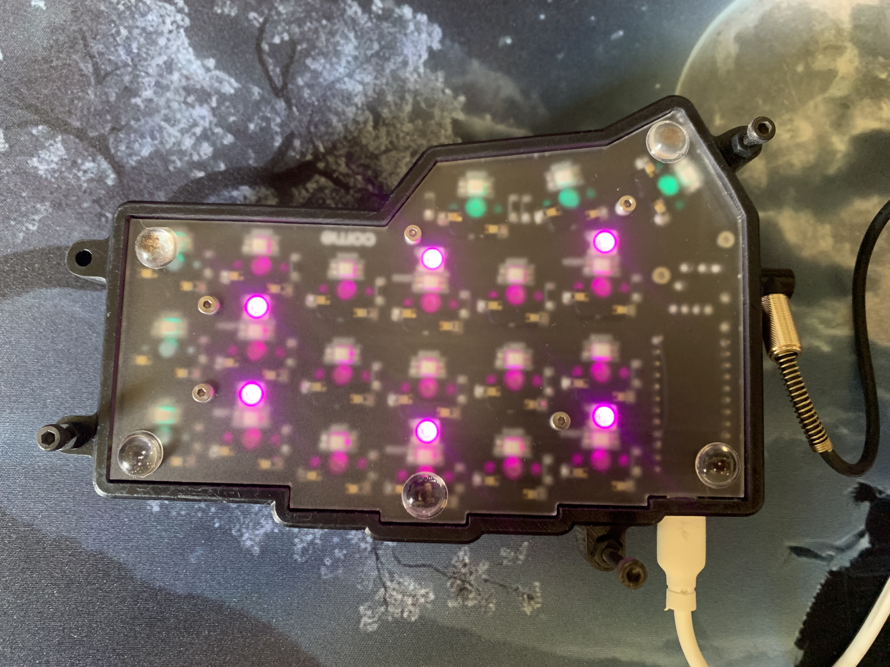

## Table of contents
- [Overview](#overview)
- [The Build](#the-build)
- [Firmware & Keymap](#firmware--keymap)
- [Mods](#mods)
- [Final Thoughts](#final-thoughts)

## Overview

A couple of years ago I decided to dip my toes into mechanical keyboards. My first board was the [X-Bows Nature](https://x-bows.com/products/x-bows-nature) — a cross-linear ergonomic keyboard with pretty wooden accents. I used it every day for over a year, but I could never get comfortable with the ever-widening rows and extreme radial stagger. The one thing it did succeed at was making me fall in love with ortholinear layouts and proper mechanical switches.

That’s when I discovered the **Corne keyboard** (aka crkbd), a gorgeous 42-key split designed by [foostan](https://github.com/foostan). The columnar stagger, aggressive pinky curve, and three thumb keys per half were exactly what I’d been looking for. Being both cheap and an engineer, buying a pre-built was never an option — I grabbed a full DIY kit from [Custom KBD](https://customkbd.com) here in Australia and had an absolute blast soldering it together.

## The Build

The Custom KBD kit includes the PCBs, hot-swap sockets, diodes, TRRS jacks, reset switches, screws/standoffs, bottom plates, underglow LEDs, and even a TRRS cable — everything except controllers, switches, keycaps and a USB-C cable.

I sourced separately:
- 2 × nice!nano v2 (wireless) or Pro Micro / RP2040-Zero (wired)
- 42 × MX switches (tried heaps — current ones are gloriously clicky, model long forgotten)
- 1 × USB-C cable
- Keycaps — [Ducky PBT Dye-Sub 132-Key MDA Profile “Dino” set](https://www.pccasegear.com/products/63876/ducky-pbt-dye-sub-132-key-mda-profile-keycap-set-dino?srsltid=AfmBOoqxFFDb0a0zFdfe2--LPF1FsPERWolrTHqRl5I4O2yMnGAu022C)

Assembly is dead easy if you follow the official v3 Corne Cherry [build guide](https://github.com/foostan/crkbd/blob/main/docs/corne-cherry/v3/buildguide_en.md).

Took me 4–5 hours across two evenings, and the hot-swap sockets mean I can still swap switches whenever the mood strikes.

## Mods

Two tiny, cheap upgrades made it perfect:

- **Tenting**  
  M3 bolts of varying lengths + nuts → solid, adjustable ~20° tent for almost nothing.

- **Case**  
  Low-profile “Corne LP” by [tominabox1](https://www.thingiverse.com/thing:5027615), printed in black resin at PCBWay. Looks stealthy and still lets a little underglow escape around the edges.

## Firmware & Keymap

I’ve run both QMK (wired) and ZMK (wireless nice!nano) on this board. Both started as the stock crkbd layout and have been heavily tweaked since.

Repos are public — steal anything you like:
- QMK → [https://github.com/cimos/qmk_config](https://github.com/cimos/qmk_config)
- ZMK → [https://github.com/cimos/zmk-config](https://github.com/cimos/zmk-config).

## Final Thoughts

This Corne has been my daily driver for over 12 months. I have zero intention of ever going back to a normal keyboard.

If you’re on the fence about building a split ortho — just do it. Soldering is nowhere near as scary as it looks, the community is ridiculously helpful, and the end result feels like it was custom-made for your hands.

**P.S.** If you’re in Australia and staring at parts lists wondering where to start, feel free to ping me (GitHub issues, X DMs, whatever). Happy to help with recommendations, soldering advice, or just give you the final nudge.

Happy Clacking!

## Build Images

  <!-- First row – big image (optional, can be removed) -->
  

    
  

  <!-- Second row – three small ones side-by-side -->
  

    
  

  

    
  

  

    
  

