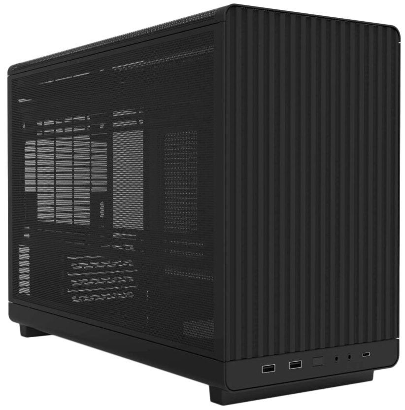
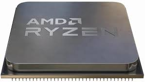
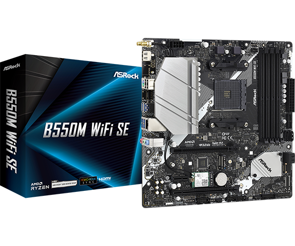

## Table of contents

- [Table of contents](#table-of-contents)
- [Fixing My PC: A Year of POST Problems and the Parts I Actually Bought](#fixing-my-pc-a-year-of-post-problems-and-the-parts-i-actually-bought)
- [Diagnosis](#diagnosis)
- [Micro ATX Case – What I Chose](#micro-atx-case--what-i-chose)
- [CPU – What I Chose](#cpu--what-i-chose)
- [Motherboard – What I Chose](#motherboard--what-i-chose)
- [Parts List I Actually Ordered](#parts-list-i-actually-ordered)

## Fixing My PC: A Year of POST Problems and the Parts I Actually Bought

I’ve been fighting random boot issues for over a year. At first it was just an occasional RAM POST error — moving a stick one slot over fixed it. Then around May this year the machine started throwing RAM and VGA errors together. The lazy fix? Keep smashing the reset button until it finally posted. Yeah, I know… but I had stuff to do and I’m cheap.

Fast-forward five months and the reset-button roulette stopped working reliably. Time to actually fix it.

### Diagnosis
- MemTest86 ran for hours → zero errors  
- PSU rails rock-solid at 12.31 V ±0.03 V  
- Swapped my brother’s known-good GTX 1070 and RAM → same problem  
- Cleared CMOS with the button-cell trick → no change  

Conclusion: the motherboard was dying, CPU was fine.

I’m a tight-arse, so my first plan was just to grab the cheapest working AM4 board I could find. A mate talked me into upgrading the CPU while I was in there… and if I’m swapping CPU and mobo I might as well get a new case too.

Here are the trade studies I actually did and what I ended up buying.

#### Micro ATX Case – What I Chose
<!-- 
| Case                                    | Price | Volume | GPU Max | Fans / Rad       | Side Panel     | My Thoughts &nbsp;&nbsp;&nbsp;&nbsp;&nbsp;&nbsp; |
|-----------------------------------------|-------|--------|---------|------------------|----------------|--------------------------------------------------|
| **Lian Li DAN-A3 Black (Mesh)** ← I bought this | $70   | 26.3 L | 415 mm  | 10 × 120 / 360 mm| Steel Mesh     | Cheap, tiny, fully enclosed mesh, no RGB/glass nonsense. Perfect. |
| Lian Li DAN-A3 Wood (Mesh)              | $85   | 26.3 L | 415 mm  | 10 × 120 / 360 mm| Steel Mesh     | Would have bought this if it was in stock      |
| Lian Li DAN-A3 Wood (Glass)             | $85   | 26.3 L | 415 mm  | 10 × 120 / 360 mm| Glass          | Glass ruins the enclosed look                  |
| Thermaltake Tower 300 (any colour)      | $170  | 53 L   | 400 mm  | 8 / 420 mm       | 3× Glass       | Way too big and expensive                      |
| DeepCool CH260 Black                    | $60   | 31 L   | 388 mm  | 6 / 360 mm       | Glass          | Cheap but full glass side                     |
| MONTECH Heritage PRO                    | $100  | 42 L   | 400 mm  | 9 / 360 mm       | Leather+Mesh   | Looks weird and bulky                          |
| InWin CS-F3 Black                       | ~$80  | ~35 L  | 340 mm  | Limited          | Mixed          | Meh specs                                      |
| FSP CST130C                             | $55   | 27 L   | 300 mm  | 3 incl.          | Glass          | Too similar to my old case                     | -->

<table>
  <thead>
    <tr style="background-color: #2c3e50; color: white;">
      <th>Case</th>
      <th>Price</th>
      <th>Volume</th>
      <th>GPU Max</th>
      <th>Fans / Rad</th>
      <th>Side Panel</th>
      <th style="width: 45%;">My Thoughts</th>
    </tr>
  </thead>
  <tbody>
    <tr style="background-color: #125f29ff;">
      <td><strong>Lian Li DAN-A3 Black (Mesh) ← I bought this</strong></td>
      <td>$70</td>
      <td>26.3 L</td>
      <td>415 mm</td>
      <td>10 × 120 / 360 mm</td>
      <td>Steel Mesh</td>
      <td>Cheap, tiny, fully enclosed mesh, no RGB/glass nonsense. Perfect.</td>
    </tr>
    <tr>
      <td>Lian Li DAN-A3 Wood (Mesh)</td>
      <td>$85</td>
      <td>26.3 L</td>
      <td>415 mm</td>
      <td>10 × 120 / 360 mm</td>
      <td>Steel Mesh</td>
      <td>Would have bought this if it was in stock</td>
    </tr>
    <tr>
      <td>Lian Li DAN-A3 Wood (Glass)</td>
      <td>$85</td>
      <td>26.3 L</td>
      <td>415 mm</td>
      <td>10 × 120 / 360 mm</td>
      <td>Glass</td>
      <td>Glass ruins the enclosed look</td>
    </tr>
    <tr>
      <td>Thermaltake Tower 300 (any colour)</td>
      <td>$170</td>
      <td>53 L</td>
      <td>400 mm</td>
      <td>8 / 420 mm</td>
      <td>3× Glass</td>
      <td>Way too big and expensive</td>
    </tr>
    <tr>
      <td>DeepCool CH260 Black</td>
      <td>$60</td>
      <td>31 L</td>
      <td>388 mm</td>
      <td>6 / 360 mm</td>
      <td>Glass</td>
      <td>Cheap but full glass side</td>
    </tr>
    <tr>
      <td>MONTECH Heritage PRO</td>
      <td>$100</td>
      <td>42 L</td>
      <td>400 mm</td>
      <td>9 / 360 mm</td>
      <td>Leather+Mesh</td>
      <td>Looks weird and bulky</td>
    </tr>
    <tr>
      <td>InWin CS-F3 Black</td>
      <td>~$80</td>
      <td>~35 L</td>
      <td>340 mm</td>
      <td>Limited</td>
      <td>Mixed</td>
      <td>Meh specs</td>
    </tr>
    <tr>
      <td>FSP CST130C</td>
      <td>$55</td>
      <td>27 L</td>
      <td>300 mm</td>
      <td>3 incl.</td>
      <td>Glass</td>
      <td>Too similar to my old case</td>
    </tr>
  </tbody>
</table>

I went with the **Lian Li DAN-A3 Black Mesh** because it’s the cheapest fully-enclosed mesh case that still swallows a 415 mm GPU and a 360 AIO. Simple, small, and no showy crap.

  

    
  

#### CPU – What I Chose

<table>
  <thead>
    <tr style="background-color: #2c3e50; color: white;">
      <th>CPU</th>
      <th>Price</th>
      <th>Cores/Threads</th>
      <th>Boost</th>
      <th>L3 Cache</th>
      <th>TDP</th>
      <th style="width: 45%;">My Thoughts</th>
    </tr>
  </thead>
  <tbody>
    <tr style="background-color: #125f29ff;">
      <td><strong>Ryzen 7 5700X ← I bought this</strong></td>
      <td>$160</td>
      <td>8/16</td>
      <td>4.6 GHz</td>
      <td>32 MB</td>
      <td>65 W</td>
      <td>Exactly the sweet spot for me — 8 real cores for not much money</td>
    </tr>
    <tr>
      <td>Ryzen 5 5500</td>
      <td>$76</td>
      <td>6/12</td>
      <td>4.2 GHz</td>
      <td>16 MB</td>
      <td>65 W</td>
      <td>Tempted, but half the cache and noticeably slower</td>
    </tr>
    <tr>
      <td>Ryzen 5 5600</td>
      <td>$107</td>
      <td>6/12</td>
      <td>4.4 GHz</td>
      <td>32 MB</td>
      <td>65 W</td>
      <td>Good, but I’d always wish I got the 8-core</td>
    </tr>
    <tr>
      <td>Ryzen 7 5800X3D</td>
      <td>$320</td>
      <td>8/16</td>
      <td>4.7 GHz</td>
      <td>96 MB</td>
      <td>105 W</td>
      <td>Amazing for gaming, but overkill and hot</td>
    </tr>
  </tbody>
</table>

I decided on the **Ryzen 7 5700X**. For ~$80 more than the 5500 I get two extra cores and double the L3 cache — totally worth it for my mix of gaming and project work.

  

    
  

#### Motherboard – What I Chose  
<table>
  <thead>
    <tr style="background-color: #2c3e50; color: white;">
      <th>Motherboard</th>
      <th>Chipset</th>
      <th>Price</th>
      <th>VRM</th>
      <th>PCIe</th>
      <th>M.2</th>
      <th>WiFi</th>
      <th style="width: 45%;">My Thoughts</th>
    </tr>
  </thead>
  <tbody>
    <tr style="background-color: #125f29ff;">
      <td><strong>ASRock B550M WiFi SE ← I bought this</strong></td>
      <td>B550</td>
      <td>$95</td>
      <td>8+2 50A</td>
      <td>4.0</td>
      <td>2 (1×Gen4)</td>
      <td>WiFi 6E</td>
      <td>PCIe 4.0, decent VRM, WiFi built-in — done</td>
    </tr>
    <tr>
      <td>MSI B450M-A PRO MAX II</td>
      <td>B450</td>
      <td>$55</td>
      <td>4+2 basic</td>
      <td>3.0 only</td>
      <td>1</td>
      <td>None</td>
      <td>Was my original “just make it work” plan</td>
    </tr>
    <tr>
      <td>ASUS TUF B550M-PLUS WiFi</td>
      <td>B550</td>
      <td>$140</td>
      <td>10+2 60A</td>
      <td>4.0</td>
      <td>2</td>
      <td>WiFi 6</td>
      <td>Overkill and overpriced for me</td>
    </tr>
    <tr>
      <td>MSI B550M PRO-VDH WIFI</td>
      <td>B550</td>
      <td>$110</td>
      <td>7+2+1</td>
      <td>4.0</td>
      <td>1</td>
      <td>WiFi 6</td>
      <td>Fine, but more expensive than the ASRock</td>
    </tr>
  </tbody>
</table>

I went with the **ASRock B550M WiFi SE** because for only $40 more than the dirt-cheap B450 it gives me PCIe 4.0, a proper VRM for the 5700X, two M.2 slots, and WiFi 6E so I don’t need a dongle. Felt like the no-brainer choice.

  

    
  

### Parts List I Actually Ordered
- Case: Lian Li DAN-A3 Black Mesh – $70  
- CPU: AMD Ryzen 7 5700X – $160  
- Motherboard: ASRock B550M WiFi SE – $95  

Total spend: ~$325