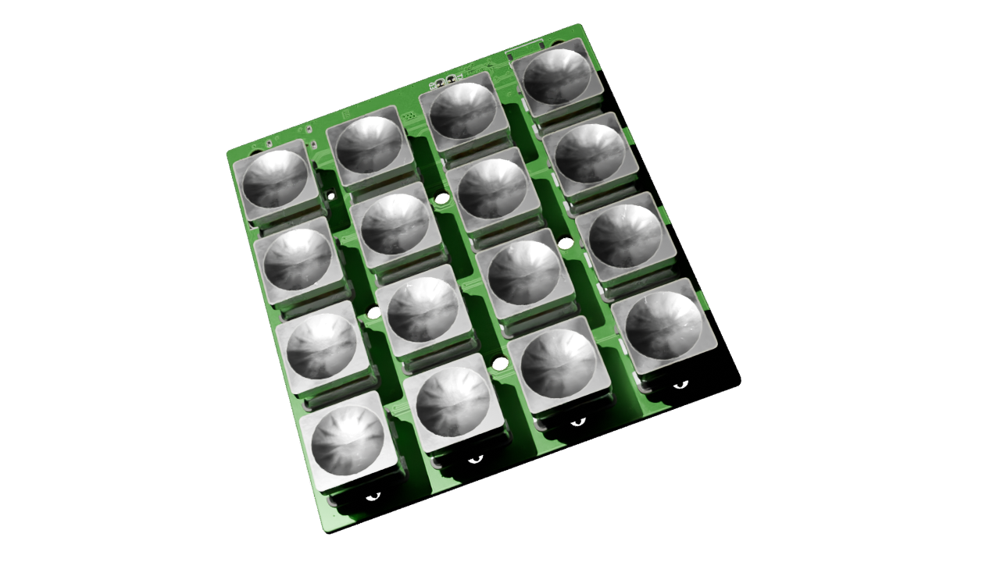
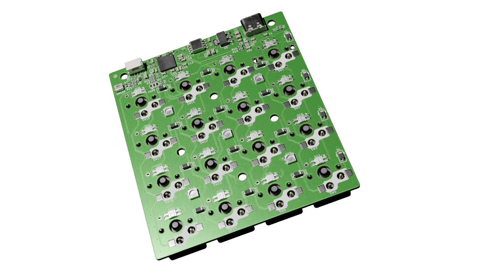
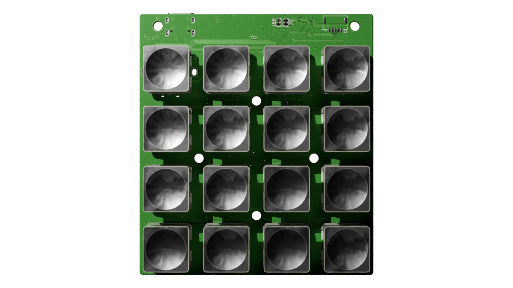
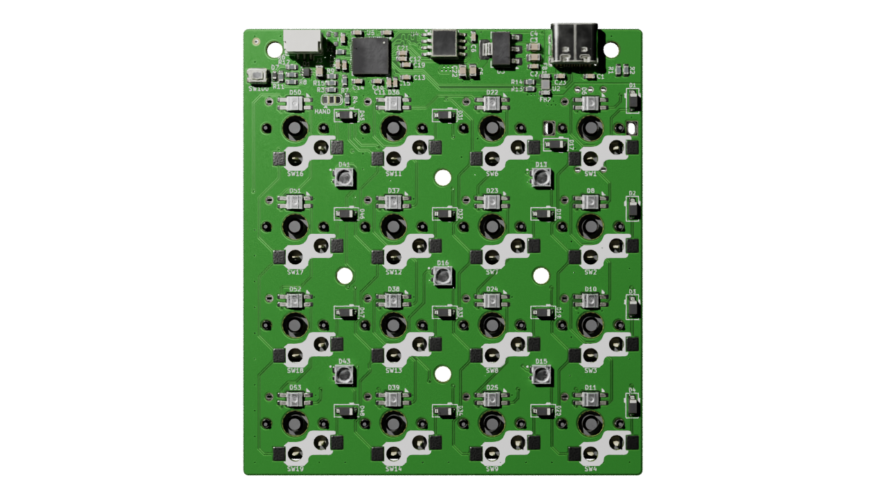
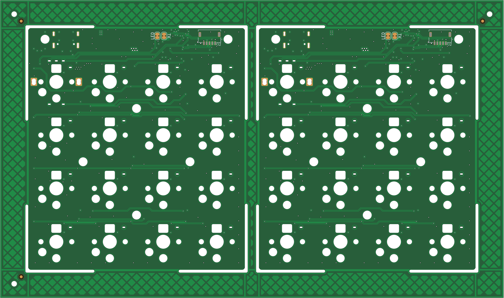

## Table of contents
- [Overview](#overview)
- [Why a test board](#why-a-test-board)
- [Rev A: 2-key test board](#rev-a-2-key-test-board)
- [Rev B: 4×4 anything keypad](#rev-b-44-anything-keypad)
- [KiBot + GitHub Actions pipeline](#kibot--github-actions-pipeline)
- [Building the boards](#building-the-boards)
- [What's next](#whats-next)
- [Renders](#renders)

## Overview

[Mad_RP2040](https://github.com/Cimos/Mad_RP2040) started in August 2024 as a 2-key test board for the RP2040, before I committed to it on a full split keyboard. It's now a 4×4 backlit "anything keypad" with USB-C, per-key SK6812MINI-E LEDs, a TRS connector, and a KiBot CI pipeline that spits out gerbers, BOMs, position files, 3D renders, panel data and visual diffs on every push.

This is what each rev was and what went wrong building them.

## Why a test board

I want to design my own split keyboard from scratch. A Corne-class board has a lot going on at once: matrix, diodes, controller, USB, per-key RGB, OLED, TRS interconnect, possibly battery management. Get the controller wrong and you can't trust anything else on the board.

Easier to prove the controller block on its own first. Small board, get the RP2040 reference design and USB-C right, prove bootloader and toolchain, then copy that block into the bigger board.

That's Rev A.

## Rev A: 2-key test board

Rev A is small. The whole BOM:

- **RP2040** with the reference circuit from the [Hardware Design with RP2040](https://datasheets.raspberrypi.com/rp2040/hardware-design-with-rp2040.pdf) guide — 1.1V core LDO, 3.3V LDO, QSPI flash, crystal and load caps, boot select button.
- **USB-C** with both CC pins pulled down through 5.1k.
- **2 × MX hot-swap sockets**, each with a 1N4148W diode.
- Power LED, reset button, four mounting holes.

No backlight, no TRS, no battery. Just enough to validate the parts I wanted to copy forward.

Archived as a zip in [`resources/rev_a/`](https://github.com/Cimos/Mad_RP2040/tree/main/resources/rev_a) along with the step models, if you want the minimal RP2040 ref design without the keypad on top.

## Rev B: 4×4 anything keypad

Once Rev A worked I started on Rev B. First pass was 4×5; once I tried to actually place 20 keys plus 20 LEDs and their decoupling caps it shrank to 4×4.

What Rev B added on top of Rev A:

- **16 keys in a 4×4 hot-swap grid.** Generic macropad layout — bind it to whatever you want in QMK.
- **Per-key SK6812MINI-E LEDs**, daisy-chained on a single PIO line. The -E variant has the LEDs aimed up through the switch hole, which is what north-facing switches need for shine-through caps.
- **TRS connector** on a header strip along the top edge, so the board can run standalone or as one half of a future split.
- **Migrated all passives to 0603.** Rev A was a mix of 0603 / 0805. JLC assembly charges least for 0603, so everything went 0603.
- **Supplier metadata in the BOM.** Every passive has LCSC, Digikey and Mouser part numbers, sorted by reference designator descending.
- **1×2 panelisation** with KiKit tabs, rendered alongside the single-board build.

Smaller fixes along the way: hidden text on fab layers, 3.3V LDO swapped from adjustable to fixed, USB diff pair impedance recalculated and rerouted, diode footprints redrawn to silk the cathode, min track spacing tightened in the DRU.

## KiBot + GitHub Actions pipeline

The most reusable thing to come out of this project is the CI. Every push to `main` runs five GitHub Actions jobs against the KiCad project:

| Job                  | What it produces                                                                                                              |
|----------------------|-------------------------------------------------------------------------------------------------------------------------------|
| **Build PCB Datapack** | Gerbers (JLC / PCBWay / Elecrow / FusionPCB / P-Ban variants), drill files, position files, schematic PDF, BOM (HTML + CSV + iBOM + KiCost), stencil DXF/STL/SCAD, design report. |
| **Build Panel Datapack** | Panelised KiCad project, panelised gerbers per fab, panel drawing PDF, panel render PNG.                                    |
| **Build 2D Images**    | Blender renders of the assembled board: top, top-straight, bottom, bottom-straight.                                          |
| **Build 3D CAD Model** | Full + simplified STEP files for mechanical CAD.                                                                              |
| **Build PCB Diff**     | Visual rev-over-rev diff against the previous merged version, so PR reviewers can see what moved.                            |

It runs on GitHub-hosted runners, driven by [KiBot](https://github.com/INTI-CMNB/KiBot) and a shared `kibot-config` repo via submodule. About two minutes wall time per push, artifacts on the run page.

Same idea as software CI: when fab needs files, I don't want to be opening KiCad and exporting ten things by hand.

## Building the boards

Both revs got fabbed and assembled. Both had a bug.

**Rev A** had D+ and D- swapped at the USB-C connector — host reported "USB device not recognized". Two scalpel cuts, two bodge wires, enumerated fine. The schematic correction went into Rev B before Rev B was sent to fab.

**Rev B** came back in November 2025. The controller side came up clean — USB enumerated, bootloader behaved, SK6812MINI-E chain lit on the first WS2812-style driver. The matrix didn't. First row and first column scanned, nothing past them did. Wiring error in the matrix beyond row/col 1. Both assembled boards had the bug because both came off the same gerbers; both got the same cut-and-bodge.

The matrix fix is not in `main` yet. The two boards work bodged and respinning gerbers to fix units I already own hasn't been worth the time. Fab from `main` today and you'll need the same mod.

Rev A still did what it was supposed to. The D+/D- swap was exactly the kind of bug worth catching on a small cheap board before it shipped into a 16-key one. The Rev B bug was in the matrix, which is new to Rev B and never got a test pass, so de-risking the controller didn't help with it.

## What's next

Mad_RP2040 is done. The CI is reusable, and the controller block is now a known-good copy-paste in the [`mad_lib`](https://github.com/Cimos/mad_lib) submodule, ready for the full split.

If you want to fab one: clone the repo, grab the latest green CI run, and the JLCPCB folder in the PCB datapack has what JLC needs. MIT-licensed. Note the matrix bug above.

## Renders

From the CI on the most recent push to `main`.

<!-- Top + bottom 3/4 view -->

  

    
  

  

    
  

<!-- Top + bottom straight-on -->

  

    
  

  

    
  

<!-- Panel render, full width -->

  

    
  

-SM
